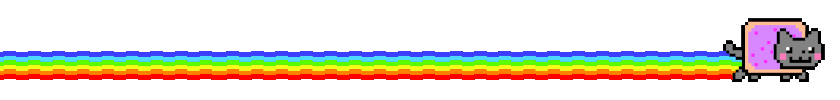

  <!-- Commented out banner image -->
  <!--  -->
  
  
  
  <h2>
  
    i do software 
    
  </h2>
  
   

            

  
<link rel="stylesheet" type="text/css" href="https://cdn.jsdelivr.net/gh/devicons/devicon@latest/devicon.min.css" />

